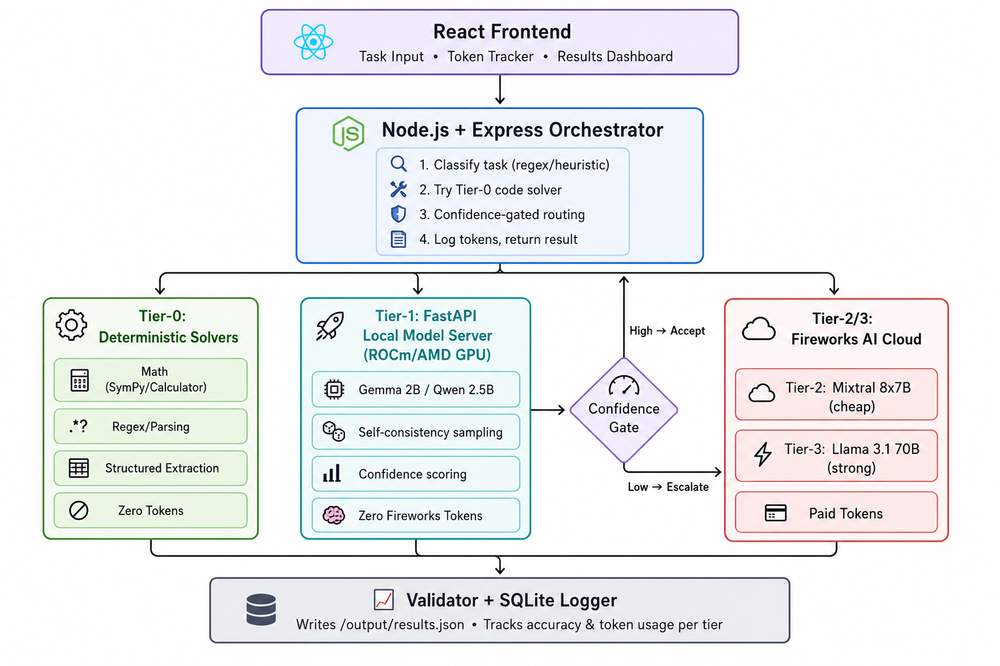

# 🚀 HybridRouter — Token-Efficient Hybrid Routing Agent

> **AMD Developer Hackathon 2026 — Track 1: Hybrid Token-Efficient Routing Agent**
>
> A multi-tier intelligent routing system that maximizes task accuracy while minimizing Fireworks API token consumption. Uses deterministic solvers, local AMD GPU-accelerated models, and confidence-gated Fireworks escalation.

---



---

## 📋 Table of Contents

- [Overview](#overview)
- [Architecture](#architecture)
- [Key Features](#key-features)
- [Quick Start](#quick-start)
- [Project Structure](#project-structure)
- [Documentation](#documentation)
- [Implementation Phases](#implementation-phases)
- [Scoring Formula](#scoring-formula)
- [Team](#team)
- [License](#license)

---

## Overview

**HybridRouter** is a multi-tiered task-solving agent built for the AMD Developer Hackathon Track 1 competition. The scoring formula rewards **accuracy above a threshold** while penalizing **Fireworks API token usage**. Our strategy: solve as much as possible with zero-cost methods (code solvers, local models on AMD GPUs) and only escalate to paid Fireworks models when confidence is low.

### The Core Insight

> Most competitors use a simple local-first → Fireworks-fallback pattern. We differentiate by having **smarter confidence-gating logic** — self-consistency checks, category-specific thresholds, and cheap verification calls — which is what separates leaderboard rank at the margin.

---

## Architecture

The system processes tasks through a **5-tier waterfall** with confidence gates at each escalation point:

```
Input Task (JSON)
      │
      ▼
┌─────────────────────────────────────┐
│  Tier 0: Classifier (zero cost)     │  Regex/heuristic → 8 categories
└─────────────────────────────────────┘
      │
      ▼
┌─────────────────────────────────────┐
│  Tier 0: Deterministic Solvers      │  Math, parsing, extraction → code
│  (zero tokens)                      │  Handles ~30-40% of tasks
└─────────────────────────────────────┘
      │ unsolved
      ▼
┌─────────────────────────────────────┐
│  Tier 1: Local LLM (AMD GPU)       │  Gemma 2B / Qwen 2.5B via ROCm
│  (zero Fireworks tokens)            │  Self-consistency + confidence score
└─────────────────────────────────────┘
      │ confidence < threshold
      ▼
┌─────────────────────────────────────┐
│  Tier 2: Fireworks Cheap Model      │  Mixtral 8x7B — verify or generate
│  (minimal tokens)                   │  Cheapest sufficient model first
└─────────────────────────────────────┘
      │ still uncertain
      ▼
┌─────────────────────────────────────┐
│  Tier 3: Fireworks Strong Model     │  Llama 3.1 70B — last resort
│  (expensive tokens)                 │  Only for high-risk escalations
└─────────────────────────────────────┘
      │
      ▼
┌─────────────────────────────────────┐
│  Validator + SQLite Logger          │  Schema validation → results.json
│                                     │  Per-tier token/accuracy tracking
└─────────────────────────────────────┘
```

### Services

| Service | Tech Stack | Purpose |
|---------|-----------|---------|
| **Orchestrator** | Node.js + Express | Task classification, routing, confidence gating |
| **Local Model Server** | Python + FastAPI + ROCm | Serves Gemma/Qwen on AMD GPU, returns confidence |
| **Fireworks Client** | Node.js (in orchestrator) | Tiered Fireworks API calls with prompt compression |
| **React Dashboard** | React + Vite | Token tracker, task monitor, results visualization |
| **SQLite Logger** | SQLite | Per-task token usage, accuracy, tier tracking |

---

## Key Features

- 🎯 **Zero-Cost Classifier** — Regex/heuristic task categorization (math, code, factual, logic, etc.)
- ⚡ **Deterministic Solvers** — Math (SymPy), parsing (regex), extraction — zero tokens, perfect accuracy
- 🧠 **Local LLM on AMD GPU** — Gemma 2B/Qwen 2.5B via ROCm — zero Fireworks tokens
- 🔒 **Confidence Gating** — Self-consistency sampling + logprob analysis before escalation
- 💰 **Tiered Fireworks Escalation** — Cheapest model first, strongest only as last resort
- 📊 **Token Budget System** — Category-specific max_tokens caps to prevent waste
- 🗄️ **Answer Caching** — Hash-based deduplication for repeated/similar tasks
- 📈 **SQLite Analytics** — Per-task, per-tier logging for threshold tuning
- 🖥️ **React Dashboard** — Real-time token usage and accuracy visualization
- 🐳 **Docker-Ready** — Single `docker compose up` for the full stack

---

## Quick Start

### Prerequisites

- Docker & Docker Compose
- AMD GPU with ROCm support (for local model serving)
- Fireworks AI API key
- Node.js 20+ (for local development)
- Python 3.11+ (for local model server)

### Run with Docker (recommended)

```bash
# Clone the repository
git clone <repo-url>
cd AMD_Developer_Hck

# Set environment variables
cp .env.example .env
# Edit .env with your FIREWORKS_API_KEY

# Build and run
docker compose up --build

# The system reads /input/tasks.json and writes /output/results.json
```

### Run Locally (development)

```bash
# 1. Start the local model server
cd services/local-model-server
pip install -r requirements.txt
python main.py

# 2. Start the orchestrator
cd services/orchestrator
npm install
npm run dev

# 3. (Optional) Start the React dashboard
cd services/dashboard
npm install
npm run dev

# 4. Run the evaluation
cd services/orchestrator
npm run evaluate

# 5. (Optional) Check or Clear in-memory cache
curl http://localhost:3000/api/cache/stats
curl -X POST http://localhost:3000/api/cache/clear
```

---

## Project Structure

```
AMD_Developer_Hck/
├── README.md                           # ← You are here
├── AGENTS.md                           # Agent behavioral instructions
├── .env.example                        # Environment variable template
├── docker-compose.yml                  # Multi-service Docker setup
├── Dockerfile                          # Main container build
│
├── docs/                               # 📚 Technical documentation
│   ├── README.md                       # Documentation index
│   ├── architecture.md                 # System architecture deep-dive
│   ├── classifier.md                   # Task classifier documentation
│   ├── tier0-deterministic-solvers.md  # Deterministic solver docs
│   ├── tier1-local-model.md            # Local model server docs
│   ├── tier2-tier3-fireworks.md        # Fireworks escalation docs
│   ├── confidence-gating.md            # Confidence gating logic
│   ├── token-tracking.md              # Token tracking & SQLite logging
│   ├── containerization.md             # Docker & deployment guide
│   ├── scoring-formula.md              # Scoring & evaluation strategy
│   ├── api-reference.md               # API endpoints reference
│   └── architecture_overview.png       # Architecture diagram
│
├── phases/                             # 📅 Implementation phases
│   ├── README.md                       # Phase overview & timeline
│   ├── phase1-foundation.md            # Project scaffolding & classifier
│   ├── phase2-deterministic-solvers.md # Tier-0 code solvers
│   ├── phase3-local-model-server.md    # FastAPI + ROCm model serving
│   ├── phase4-fireworks-integration.md # Fireworks client & tiering
│   ├── phase5-confidence-gating.md     # Confidence logic & thresholds
│   ├── phase6-token-optimization.md    # Prompt compression & caching
│   ├── phase7-containerization.md      # Docker, CI, submission
│   └── phase8-dashboard-polish.md      # React UI & final polish
│
├── services/                           # 🔧 Application services
│   ├── orchestrator/                   # Node.js + Express orchestrator
│   │   ├── src/
│   │   │   ├── classifier.js           # Task classification engine
│   │   │   ├── router.js               # Multi-tier routing logic
│   │   │   ├── solvers/
│   │   │   │   ├── deterministic.js    # Math, regex, parsing solvers
│   │   │   │   ├── localLlm.js         # Local model client
│   │   │   │   └── fireworksClient.js  # Fireworks API client
│   │   │   ├── confidence.js           # Confidence gating module
│   │   │   ├── cache.js                # Answer caching
│   │   │   ├── validator.js            # Output schema validation
│   │   │   ├── logger.js               # SQLite token/accuracy logger
│   │   │   └── server.js               # Express API server
│   │   ├── main.js                     # Entry point (batch mode)
│   │   ├── package.json
│   │   └── Dockerfile
│   │
│   ├── local-model-server/             # Python + FastAPI model server
│   │   ├── main.py                     # FastAPI app
│   │   ├── model_manager.py            # Model loading & inference
│   │   ├── confidence_scorer.py        # Confidence scoring module
│   │   ├── requirements.txt
│   │   └── Dockerfile
│   │
│   └── dashboard/                      # React + Vite frontend
│       ├── src/
│       ├── package.json
│       └── Dockerfile
│
├── eval/                               # 🧪 Evaluation & testing
│   ├── benchmark.json                  # Local test benchmark
│   ├── eval_runner.js                  # Automated eval harness
│   └── scoring.js                      # Local scoring calculator
│
└── data/                               # 📦 Runtime data
    ├── cache/                          # Answer cache
    └── logs/                           # SQLite databases
```

---

## 📚 Documentation

### Core Documentation (`docs/`)

| Document | Description |
|----------|-------------|
| [📖 Documentation Index](docs/README.md) | Full documentation table of contents |
| [🏗️ Architecture Deep-Dive](docs/architecture.md) | System architecture, data flow, service interactions |
| [🏷️ Task Classifier](docs/classifier.md) | Regex/heuristic classification engine, 8 task categories |
| [⚡ Tier-0 Deterministic Solvers](docs/tier0-deterministic-solvers.md) | Math, parsing, extraction — zero-token solvers |
| [🧠 Tier-1 Local Model Server](docs/tier1-local-model.md) | FastAPI + ROCm, Gemma/Qwen, self-consistency |
| [☁️ Tier-2/3 Fireworks Escalation](docs/tier2-tier3-fireworks.md) | Tiered Fireworks API usage, model selection |
| [🔒 Confidence Gating](docs/confidence-gating.md) | Confidence scoring, thresholds, escalation logic |
| [📊 Token Tracking & Logging](docs/token-tracking.md) | SQLite logging, per-tier analytics, budget system |
| [🐳 Containerization Guide](docs/containerization.md) | Docker setup, multi-service compose, deployment |
| [🏆 Scoring Formula & Strategy](docs/scoring-formula.md) | Competition scoring, optimization strategy |
| [🔌 API Reference](docs/api-reference.md) | All REST API endpoints across services |

---

## 📅 Implementation Phases

| Phase | Title | Key Deliverables | Est. Time |
|-------|-------|-----------------|-----------|
| [Phase 1](phases/phase1-foundation.md) | **Foundation & Classifier** | Project scaffold, classifier engine, basic routing | 3-4 hrs |
| [Phase 2](phases/phase2-deterministic-solvers.md) | **Deterministic Solvers** | Math, regex, parsing solvers — zero tokens | 3-4 hrs |
| [Phase 3](phases/phase3-local-model-server.md) | **Local Model Server** | FastAPI + ROCm, Gemma/Qwen serving | 4-5 hrs |
| [Phase 4](phases/phase4-fireworks-integration.md) | **Fireworks Integration** | Tiered Fireworks client, prompt compression | 3-4 hrs |
| [Phase 5](phases/phase5-confidence-gating.md) | **Confidence Gating** | Self-consistency, thresholds, smart escalation | 4-5 hrs |
| [Phase 6](phases/phase6-token-optimization.md) | **Token Optimization** | Caching, budget caps, prompt compression | 2-3 hrs |
| [Phase 7](phases/phase7-containerization.md) | **Containerization** | Docker, docker-compose, submission readiness | 3-4 hrs |
| [Phase 8](phases/phase8-dashboard-polish.md) | **Dashboard & Polish** | React dashboard, final testing, README polish | 3-4 hrs |

👉 See the [Phase Overview & Timeline](phases/README.md) for the full implementation roadmap.

---

## Scoring Formula

```
Score = Accuracy_Score - Token_Penalty

Where:
  Accuracy_Score = (correct_answers / total_tasks) * 100
  Token_Penalty  = fireworks_tokens_used * cost_per_token_multiplier

Only tokens through FIREWORKS_BASE_URL count.
Local model tokens are FREE.
Deterministic solver tokens are FREE.
```

### Our Token Budget Strategy

| Task Category | Expected Solver | Max Fireworks Tokens | Notes |
|---------------|----------------|---------------------|-------|
| Math | Tier-0 (SymPy) | 0 | Solved by code |
| Parsing | Tier-0 (Regex) | 0 | Solved by code |
| Classification | Tier-1 (Local) | 0-50 | Short answers |
| Factual Q&A | Tier-1 → Tier-2 | 50-200 | Escalate if unsure |
| Code Generation | Tier-1 → Tier-2 | 100-500 | Category-specific cap |
| Logic/Reasoning | Tier-1 → Tier-3 | 200-800 | May need strong model |
| Creative Writing | Tier-2 | 100-300 | Cheap model sufficient |
| Multi-step | Tier-2 → Tier-3 | 300-1000 | Last resort escalation |

---

## Team

| Role | Responsibility |
|------|---------------|
| **Member A** | Classifier + Tier-0 deterministic solvers + confidence-gating router |
| **Member B** | FastAPI local model server + Fireworks client + token logging |
| **Member C** | React dashboard + Docker packaging + README |

---

## License

See [LICENSE](LICENSE) for details.

---

<p align="center">
  <b>Built for AMD Developer Hackathon 2026 — Track 1</b><br/>
  <i>Maximize accuracy. Minimize tokens. Win.</i>
</p>
