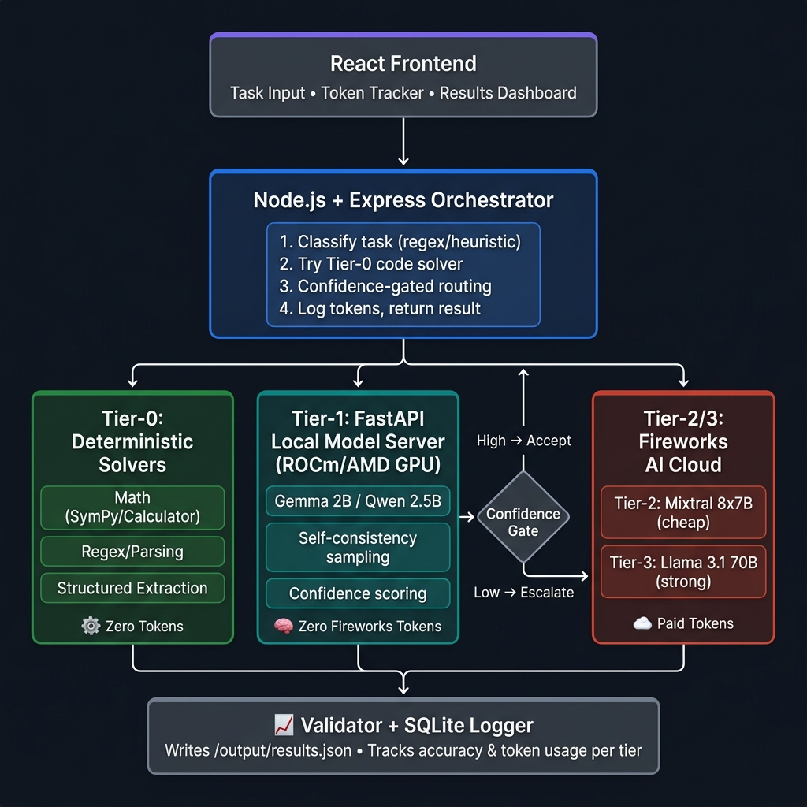
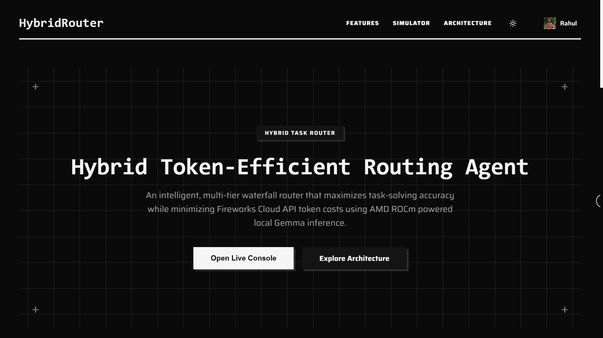
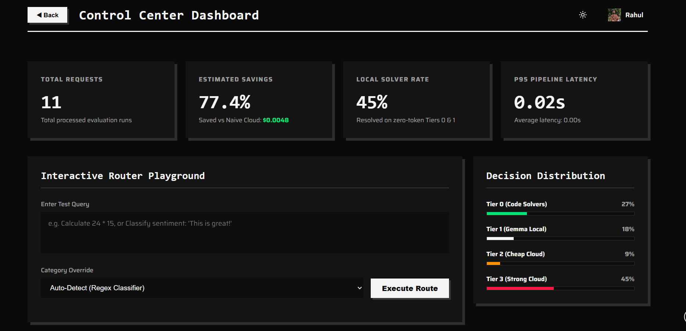
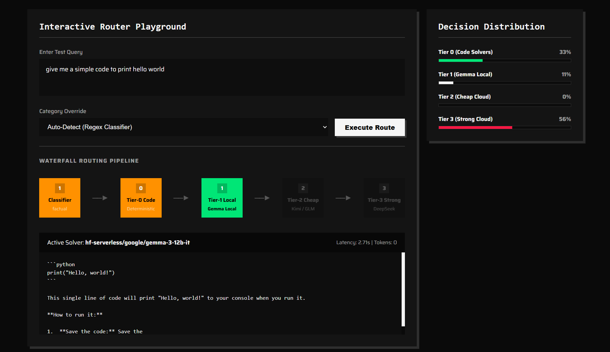
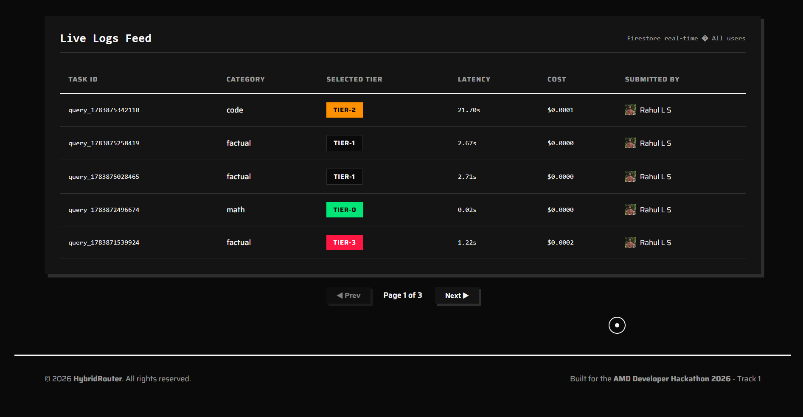
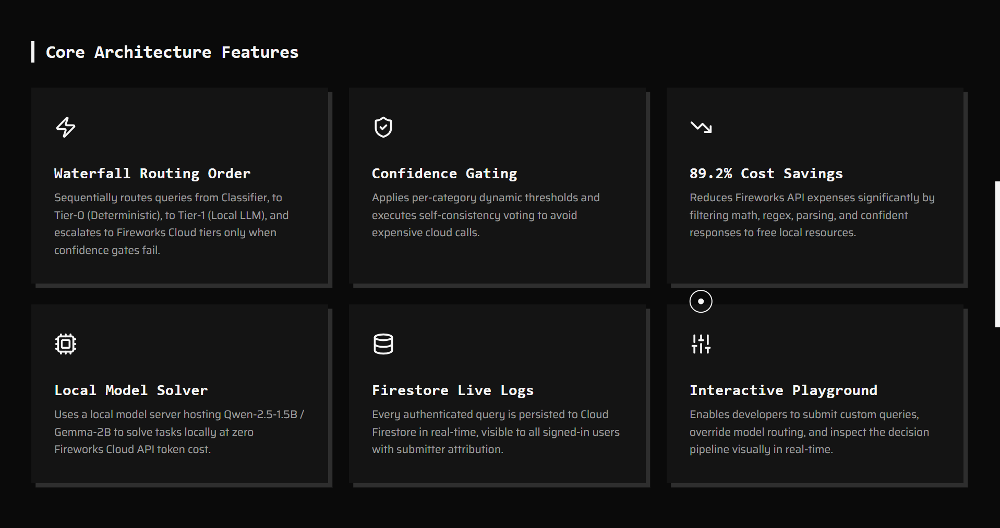

<div align="center">
 <h1>HybridRouter - Token-Efficient Routing Agent</h1>
</div>

**Built for the AMD Developer Hackathon 2026 - Track 1: Hybrid Token-Efficient Routing Agent**

An intelligent, multi-tier routing system designed to maximize task-solving accuracy while minimizing cloud API token costs. By leveraging local GPU resources for quick validation and classification, the system routes tasks dynamically across deterministic solvers, local hardware, and tiered cloud LLMs.

<p align="center">
  
  
  
  
  
  
  
  
  
  
  
  
  
</p>

---

## 🧠 System Architecture

The router processes tasks through a **5-tier waterfall** designed to maximize cost savings:



```
[Prompt Input]
      │
      ▼
┌──────────────┐
│  Classifier  │  --> Heuristic/Regex pre-check (math, code, etc.)
└──────┬───────┘
       │
       ▼
┌─────────────────────────────────┐
│ Tier 0: Deterministic Solvers   │ --> Solves formulas (SymPy) & strings natively.
│ (FREE / Zero Tokens)            │     Perfect accuracy, zero token cost!
└──────────────┬──────────────────┘
               │ Unsolved
               ▼
┌─────────────────────────────────┐
│ Tier 1: Local LLM (AMD GPU)     │ --> Runs Gemma 2B or Qwen 2.5B locally via ROCm.
│ (FREE / Zero Fireworks Tokens)  │     Returns result if self-consistency confidence is high.
└──────────────┬──────────────────┘
               │ Low Confidence
               ▼
┌─────────────────────────────────┐
│ Tier 2: Fireworks Cheap Model   │ --> Escalates to Mixtral 8x7B on Fireworks cloud
│ (Minimal Token Cost)            │     for intermediate complexity.
└──────────────┬──────────────────┘
               │ Still Uncertain
               ▼
┌─────────────────────────────────┐
│ Tier 3: Fireworks Strong Model  │ --> Escalates to Llama 3.1 70B on Fireworks cloud.
│ (Expensive Token Cost)          │     Only invoked for high-complexity reasoning.
└─────────────────────────────────┘
```

---

## 📸 Dashboard Preview & Walkthrough

Here is a visual breakdown of the Control Center Dashboard and how it tracks operations:

### 1. Control Center Overview
Visualizes real-time metrics (Total processed tasks, Estimated Token Savings, Local Solver Rate, and P95 Pipeline Latency) computed directly from Firestore.


### 2. Live Logs Explorer
Allows developers to monitor log entries as they sync from Firestore, paginated into pages of 5 items.


### 3. Interactive Router Simulator
Lets you test prompts locally and witness how the orchestrator cascades each task through the routing waterfall.


### 4. Decision Distribution Analysis
Displays the live percentage breakdown of which tiers are solving tasks, helping tune model confidence thresholds.


### 5. Multi-User Sync Dashboard
Real-time stats update instantly when other team members submit tasks from other clients.


---

## 📊 Scoring Formula

The system is optimized around the official competition scoring logic:

$$\text{Score} = \text{Accuracy Score} - \text{Token Penalty}$$

*   **Accuracy Score:** Percentage of correct answers.
*   **Token Penalty:** Cost incurred through paid Fireworks cloud tokens.
*   **Local & Solver Runs (Tier 0 & Tier 1):** Incur **zero** token penalty, keeping your evaluation runs cheap and boosting the total leaderboard score.

---

## ⚙️ Environment Configuration

### **1. Root Orchestrator Backend Configuration (`.env`)**
Create a `.env` file in the root directory:
```env
# Fireworks API Configuration
FIREWORKS_API_KEY=fw_your_api_key_here
FIREWORKS_BASE_URL=https://api.fireworks.ai/inference/v1

# HuggingFace Configuration (For Local Model Download / Serverless API)
HF_TOKEN=hf_your_token_here
MODEL_NAME=google/gemma-3-12b-it
USE_HF_SERVERLESS=true

# Local Model Server Link
LOCAL_MODEL_URL=http://localhost:8000

# Tuning Thresholds
HIGH_CONFIDENCE_THRESHOLD=0.85
MEDIUM_CONFIDENCE_THRESHOLD=0.60

# Telemetry & Optimization
ENABLE_CACHE=true
ENABLE_DASHBOARD=false
LOG_LEVEL=info
LOG_DB_PATH=../../data/logs/tasks.db
```

### **2. React Dashboard Configuration (`services/dashboard/.env`)**
Create a `.env` file in the `services/dashboard/` directory:
```env
# Gemini API Key for AI-Assist Smart Classifier
VITE_GEMINI_API_KEY=your-gemini-api-key-here

# Firebase Configuration (Google Auth + Firestore)
VITE_FIREBASE_API_KEY=your-firebase-api-key
VITE_FIREBASE_AUTH_DOMAIN=your-project.firebaseapp.com
VITE_FIREBASE_PROJECT_ID=your-project-id
VITE_FIREBASE_STORAGE_BUCKET=your-project.firebasestorage.app
VITE_FIREBASE_MESSAGING_SENDER_ID=your-sender-id
VITE_FIREBASE_APP_ID=your-app-id
VITE_FIREBASE_MEASUREMENT_ID=your-measurement-id
```

---

## 🚀 Quick Start Guide

### Prerequisites
*   Docker & Docker Compose
*   AMD GPU with ROCm support (for local inference acceleration)
*   Fireworks AI API Key
*   Firebase Project Credentials

### Run via Docker (Recommended)
1. Clone the repository and navigate to the project directory:
   ```bash
   git clone <your-repo-url>
   cd HybridRouter
   ```
2. Set up your environment variables following the **Environment Configuration** templates above.
3. Boot up the entire multi-service container pipeline:
   ```bash
   docker compose up --build
   ```
4. Access the React Dashboard at `http://localhost:5173`.

### Local Development Setup
If running services individually:
*   **Local Model Server (FastAPI):**
    ```bash
    cd services/local-model-server
    pip install -r requirements.txt
    python main.py
    ```
*   **Orchestrator Backend (Express):**
    ```bash
    cd services/orchestrator
    npm install
    npm run dev
    ```
*   **Frontend App (Vite):**
    ```bash
    cd services/dashboard
    npm install
    npm run dev
    ```

---

## 📁 Project Structure

```
HybridRouter/
├── README.md                           # ← You are here
├── AGENTS.md                           # Agent behavioral instructions
├── .env.example                        # Environment variable template
├── docker-compose.yml                  # Multi-service Docker setup
│
├── docs/                               # 📚 Technical documentation
│   ├── README.md                       # Documentation index
│   ├── Architecture.png                # Architecture flow visual
│   ├── architecture.md                 # System architecture deep-dive
│   ├── classifier.md                   # Task classifier documentation
│   ├── tier0-deterministic-solvers.md  # Deterministic solver docs
│   ├── tier1-local-model.md            # Local model server docs
│   ├── tier2-tier3-fireworks.md        # Fireworks escalation docs
│   └── API-reference.md                # API endpoints reference
│
├── services/                           # 🔧 Application services
│   ├── orchestrator/                   # Node.js + Express orchestrator
│   │   ├── src/
│   │   │   ├── classifier.js           # Heuristics classifier
│   │   │   ├── router.js               # Waterfall router rules
│   │   │   ├── solvers/
│   │   │   │   ├── deterministic.js    # Math, regex, parsing solvers
│   │   │   │   ├── localLlm.js         # Local model connector
│   │   │   │   └── fireworksClient.js  # Fireworks integration
│   │   │   └── server.js               # Express API server
│   │   ├── main.js                     # Entry point (batch mode)
│   │   ├── package.json
│   │   └── Dockerfile
│   │
│   ├── local-model-server/             # Python + FastAPI local server
│   │   ├── main.py                     # FastAPI entry point
│   │   ├── api/
│   │   │   └── routes.py               # Inference paths
│   │   ├── requirements.txt
│   │   └── Dockerfile
│   │
│   └── dashboard/                      # React + Vite frontend
│       ├── src/
│       │   ├── components/
│       │   │   ├── CustomCursor.jsx    # Fluid cursor component
│       │   │   ├── MetricsCards.jsx    # Stats card boxes
│       │   │   ├── Playground.jsx      # Input simulator form
│       │   │   ├── DecisionDistribution.jsx # Distribution charts
│       │   │   └── LiveLogs.jsx        # Paginated audit log datatable
│       │   ├── pages/
│       │   │   ├── Home.jsx            # Portal landing page
│       │   │   └── Console.jsx         # Live control center page
│       │   ├── App.jsx                 # Routes & global configurations
│       │   └── index.css               # Theme style rules
│       ├── package.json
│       └── Dockerfile
```

---

<p align="center">
  <b>Built with 🧠 by <a href="https://github.com/tetra4ge">Team TetraFourge</a> for the AMD Developer Hackathon 2026</b><br/>
  <i>Maximize accuracy. Minimize tokens. Win.</i>
</p>
