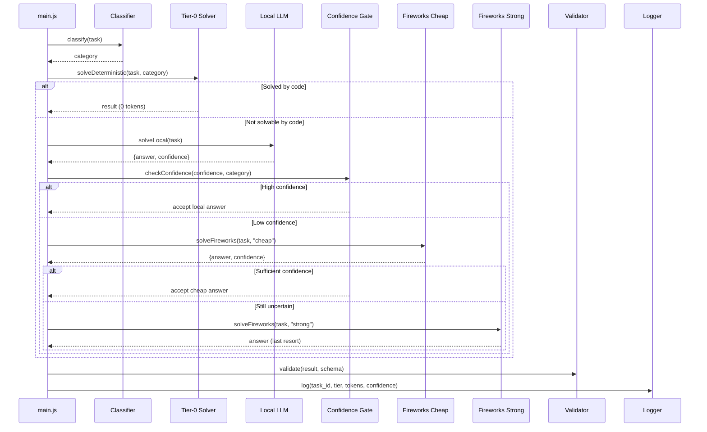
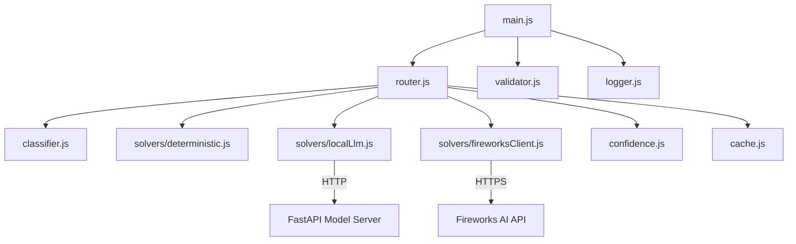

# 🏗️ Architecture Deep-Dive

> Complete system architecture for the HybridRouter token-efficient routing agent.

---

## System Overview

HybridRouter is a **multi-service, multi-tier** task-solving system. Each incoming task flows through progressively more expensive solving tiers, with confidence gates preventing unnecessary escalation.

### Design Principles

1. **Cost Minimization First** — Every design decision optimizes for minimum Fireworks token spend.
2. **Accuracy Above Threshold** — Token savings mean nothing if accuracy drops below the competition threshold.
3. **Fail-Forward** — If a tier fails or errors, escalate to the next tier rather than returning an error.
4. **Observability** — Every tier transition, token spend, and confidence score is logged for threshold tuning.

---

## Service Architecture

```
┌──────────────────────────────────────────────────────────────┐
│                    Docker Compose Network                      │
│                                                                │
│  ┌─────────────────────┐       ┌─────────────────────────┐    │
│  │   React Dashboard    │◄──────│   Node.js Orchestrator   │   │
│  │   (port 3000)        │ REST  │   (port 4000)            │   │
│  │                      │       │                          │   │
│  │  • Token charts      │       │  • Task classifier       │   │
│  │  • Accuracy monitor  │       │  • Tier-0 solvers        │   │
│  │  • Task browser      │       │  • Routing engine        │   │
│  └─────────────────────┘       │  • Confidence gate       │   │
│                                 │  • Cache manager         │   │
│                                 │  • Validator/writer      │   │
│                                 │  • SQLite logger         │   │
│                                 └──────┬──────┬───────────┘    │
│                                        │      │                │
│                                   REST │      │ REST           │
│                                        │      │                │
│                          ┌─────────────▼┐    │                │
│                          │  FastAPI       │    │                │
│                          │  Local Model   │    │                │
│                          │  Server        │    │                │
│                          │  (port 8000)   │    │                │
│                          │               │    │                │
│                          │  • Gemma 2B   │    │                │
│                          │  • Qwen 2.5B  │    │                │
│                          │  • ROCm/GPU   │    │                │
│                          │  • Confidence  │    │                │
│                          └──────────────┘    │                │
│                                              │                │
└──────────────────────────────────────────────┼────────────────┘
                                               │
                                          HTTPS │ (paid tokens)
                                               │
                                    ┌──────────▼──────────┐
                                    │  Fireworks AI Cloud   │
                                    │                       │
                                    │  • Mixtral 8x7B      │
                                    │  • Llama 3.1 70B     │
                                    └───────────────────────┘
```

---

## Data Flow

### Request Lifecycle



### Data Schema

#### Input Task

```json
{
  "id": "task_001",
  "type": "question",
  "content": "What is the square root of 144?",
  "metadata": {
    "category_hint": null,
    "expected_format": "number"
  }
}
```

#### Output Result

```json
{
  "id": "task_001",
  "answer": "12",
  "metadata": {
    "tier_used": "tier-0",
    "tokens_used": 0,
    "confidence": 1.0,
    "solver": "deterministic/math",
    "latency_ms": 2
  }
}
```

---

## Module Dependency Graph



---

## Configuration

### Environment Variables

| Variable | Required | Default | Description |
|----------|----------|---------|-------------|
| `FIREWORKS_API_KEY` | ✅ | — | Fireworks AI API key |
| `FIREWORKS_BASE_URL` | ✅ | `https://api.fireworks.ai/inference/v1` | Fireworks API base URL |
| `LOCAL_MODEL_URL` | ✅ | `http://localhost:8000` | Local model server URL |
| `HIGH_CONFIDENCE_THRESHOLD` | ❌ | `0.85` | Accept local answer threshold |
| `MEDIUM_CONFIDENCE_THRESHOLD` | ❌ | `0.60` | Escalate to strong model threshold |
| `ENABLE_CACHE` | ❌ | `true` | Enable answer caching |
| `MAX_LOCAL_SAMPLES` | ❌ | `3` | Self-consistency sample count |
| `LOG_LEVEL` | ❌ | `info` | Logging verbosity |

---

## Related Documents

- [🏷️ Classifier](classifier.md) — How tasks are categorized
- [⚡ Tier-0 Solvers](tier0-deterministic-solvers.md) — Deterministic code solvers
- [🧠 Tier-1 Local Model](tier1-local-model.md) — Local LLM serving
- [☁️ Tier-2/3 Fireworks](tier2-tier3-fireworks.md) — Cloud model escalation
- [🔒 Confidence Gating](confidence-gating.md) — Escalation decision logic
