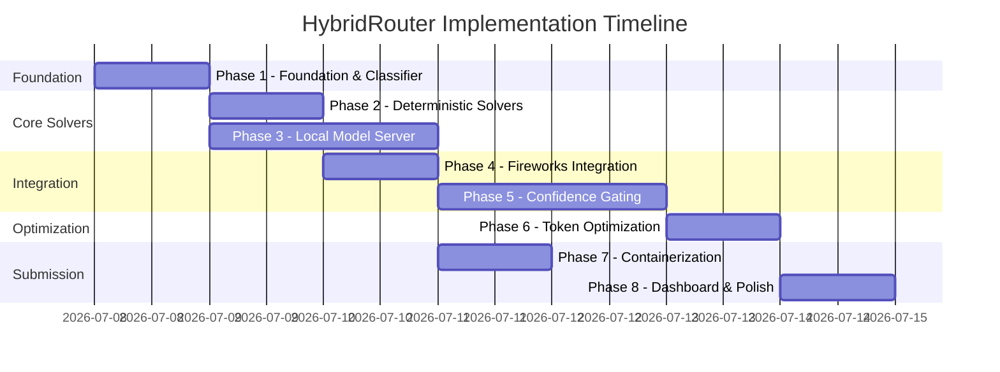

# 📅 Implementation Phases — Overview & Timeline

> Step-by-step build plan for the HybridRouter project.

---

## Phase Roadmap



---

## Phases at a Glance

| Phase | Title | Owner | Dependencies | Est. Time | Status |
|-------|-------|-------|-------------|-----------|--------|
| [Phase 1](phase1-foundation.md) | **Foundation & Classifier** | All | None | 3-4 hrs | ⬜ Not started |
| [Phase 2](phase2-deterministic-solvers.md) | **Deterministic Solvers** | Member A | Phase 1 | 3-4 hrs | ⬜ Not started |
| [Phase 3](phase3-local-model-server.md) | **Local Model Server** | Member B | Phase 1 | 4-5 hrs | ⬜ Not started |
| [Phase 4](phase4-fireworks-integration.md) | **Fireworks Integration** | Member B | Phase 1 | 3-4 hrs | ⬜ Not started |
| [Phase 5](phase5-confidence-gating.md) | **Confidence Gating** | Member A | Phase 3 | 4-5 hrs | ⬜ Not started |
| [Phase 6](phase6-token-optimization.md) | **Token Optimization** | Member A | Phase 5 | 2-3 hrs | ⬜ Not started |
| [Phase 7](phase7-containerization.md) | **Containerization** | Member C | Phase 4 | 3-4 hrs | ⬜ Not started |
| [Phase 8](phase8-dashboard-polish.md) | **Dashboard & Polish** | Member C | Phase 6 | 3-4 hrs | ⬜ Not started |

---

## Parallel Work Tracks

### Track A (Scoring-Critical Logic) — Member A

```
Phase 1 → Phase 2 → Phase 5 → Phase 6
(Classifier → Solvers → Confidence → Optimization)
```

### Track B (Model Serving & API) — Member B

```
Phase 1 → Phase 3 → Phase 4
(Classifier → Local Model → Fireworks)
```

### Track C (Infrastructure & UI) — Member C

```
Phase 1 → Phase 7 → Phase 8
(Classifier → Docker → Dashboard)
```

---

## Critical Path

The **scoring-critical path** is:

```
Phase 1 (Classifier) → Phase 2 (Tier-0) → Phase 3 (Local Model) → Phase 5 (Confidence) → Phase 6 (Optimization) → Phase 7 (Docker)
```

The dashboard (Phase 8) is **not on the critical path** — it can be built last or skipped entirely. Scoring runs headlessly.

---

## Completion Criteria

### Minimum Viable Submission

- [ ] Classifier categorizes tasks
- [ ] Deterministic solvers handle math/parsing
- [ ] Local model serves inference
- [ ] Fireworks client works
- [ ] Results written to `/output/results.json`
- [ ] Docker container builds and runs

### Competition-Ready Submission

- [ ] All above, PLUS:
- [ ] Confidence gating with per-category thresholds
- [ ] Verification mode (5 tokens vs 100+)
- [ ] Answer caching
- [ ] Prompt compression
- [ ] Local eval harness showing accuracy + tokens
- [ ] Tuned thresholds from eval runs

### Top-3 Submission

- [ ] All above, PLUS:
- [ ] Multi-signal confidence (consistency + hedging + length)
- [ ] Category-specific token budgets
- [ ] Self-consistency sampling
- [ ] Aggressive Tier-0 coverage (40%+ of tasks)
- [ ] Dashboard for demo

---

## Related Documents

- [📋 Main README](../README.md) — Project overview
- [📚 Documentation Index](../docs/README.md) — Technical docs
- [🤖 AGENTS.md](../AGENTS.md) — Agent rules
